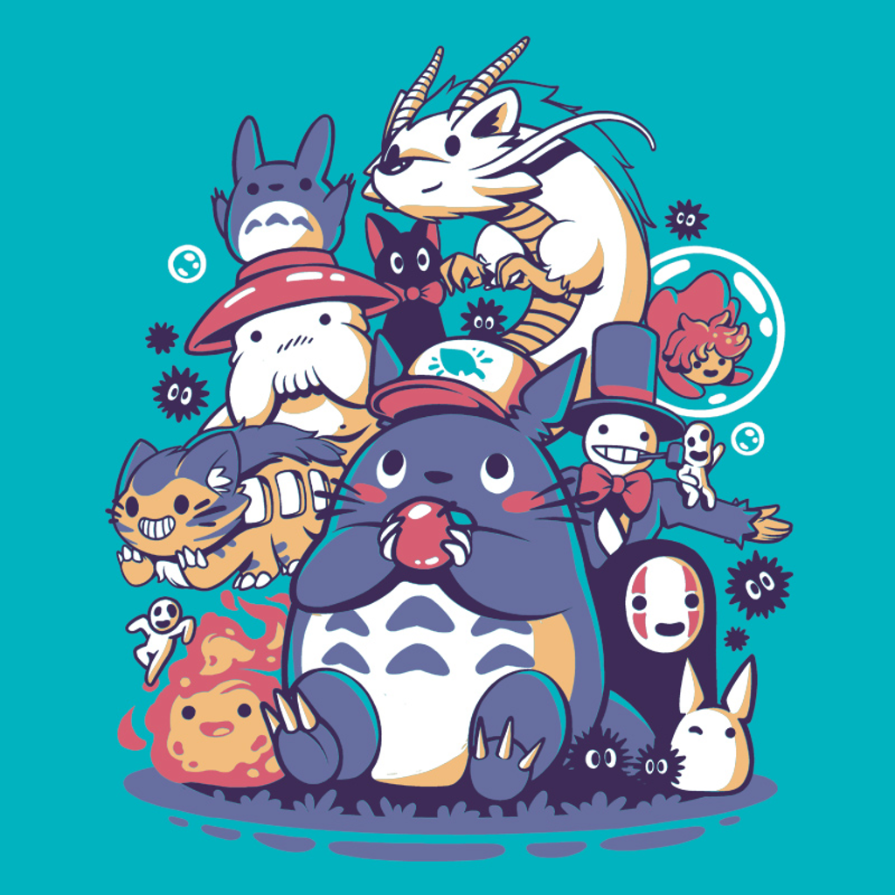

# Studio Ghibli World

## Description

The principal idea is to have in just one web all the information about the GHIBLI movies with a section with the most representative images and another section whit a little QUIZ.

## MVP

 MVP - Minimum Viable Product:

**	Home -** Is the first part that the users will see, and because of that, we use this part to introduce STUDIO GHIBLI WORLD to them with a brief description and some famous facts.

**	Movies -** As the principal motive of the web, we must show to the user the work of STUDIO GHIBLI, their MOVIES for what they are globally recognized.

**	Gallery -** After that they got in the STUDIO GHIBLI movies, here we show to the users a little collection captures and art of their movies.

**	Test yourself! -** This is the funniest part of the web, prove what do you know about STUDIO GHIBLI!

**	Login / Registration -** A sign in for existing users and registration form for new ones.

## **Backlog**

#### **Extra features:**

**User’s profile -** Where they will find: Like/Love button to save their favourite movies and a ranking of their best marks on the QUIZ.

**Filter in movies page -** to make easier for users to find their favourite movie.		

## **Wireframes**

List of pages, and/or link to your sketchs

## **Data structure**

- root/	
  - index.html	
  - movies.html	
  - gallery.html	
  - quiz.html	
  - login.html	
  - register.html	
  - css/		
    - style.css	
  - src/		
    - main.js		
    - signup.js		
    - user.js		
    - validator.js		
    - api.js	
  - assets/		
    - images/ 

## **APIs**

The API(s) you are using

## Links

#### Trello

 (list of tasks)**[Link url](https://trello.com/)**

#### Github

URls for the project repo and deploy [Link Repo](http://github.com/) 

#### Slides

URls for the project presentation (slides) [Link Slides.com](http://slides.com/)
